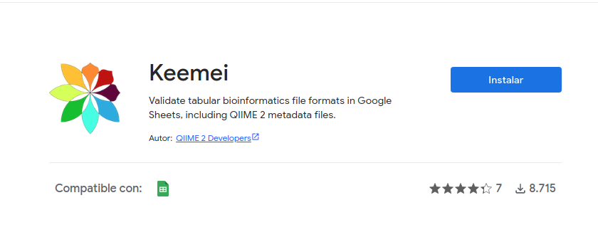
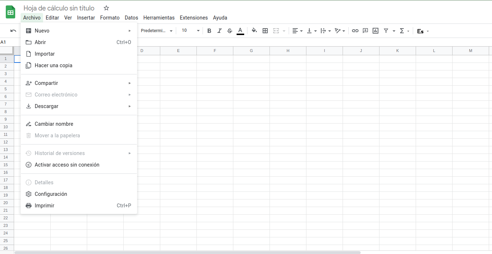
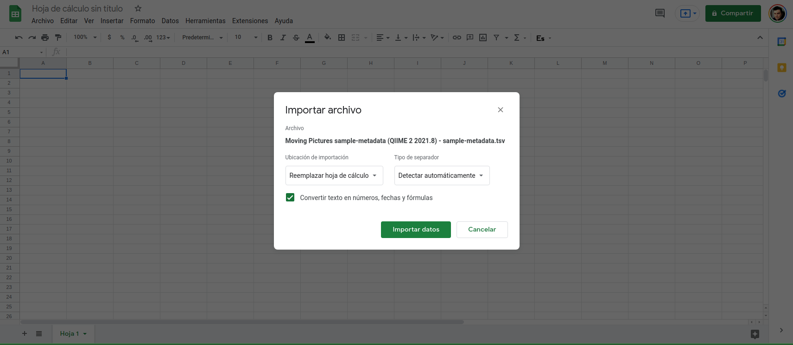
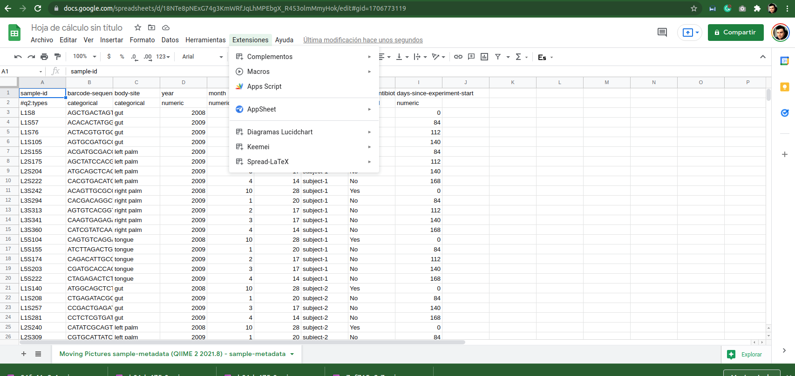
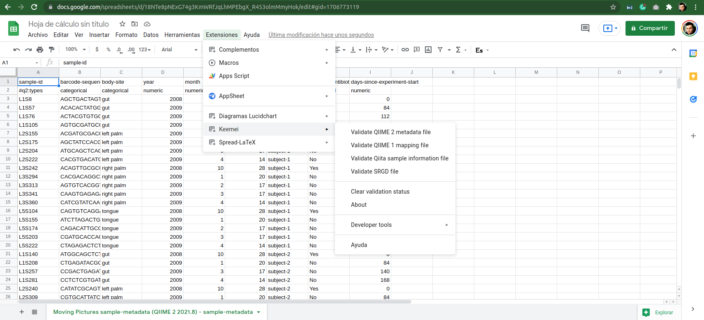
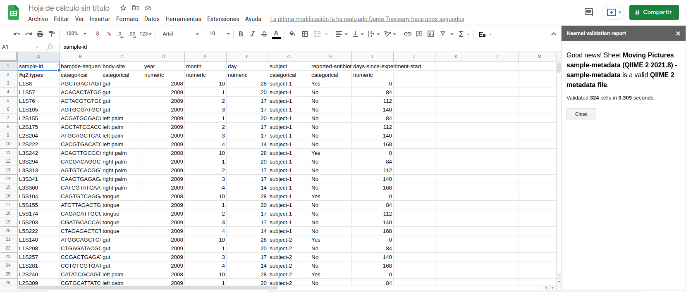
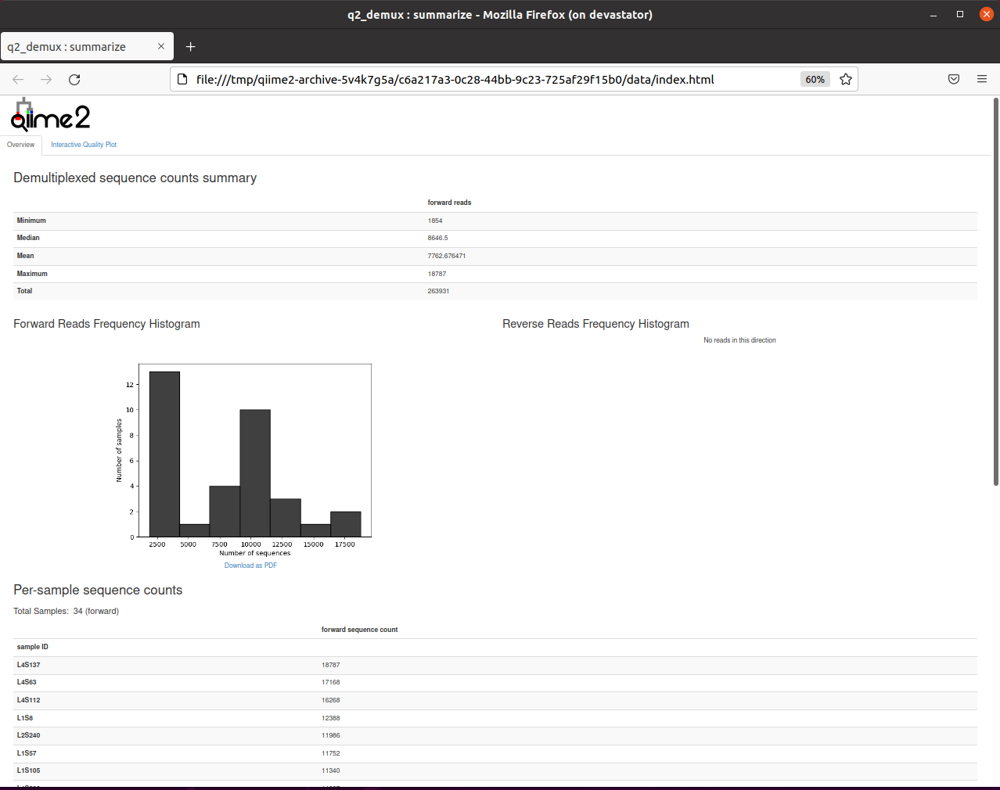

# Microbial Surveys

En el presente tutorial, el alumno deberá ejecutar por si solo los comandos y deberá responder las preguntas del documento que se entregará el día lunes 4 de diciembre del 2023. Utilizaremos `QIIME 2` para realizar un análisis de muestras de microbioma humano de dos individuos en cuatro sitios del cuerpo en cinco puntos de tiempo, el primero de los cuales siguió inmediatamente al uso de antibióticos. Un estudio basado en estas muestras se publicó originalmente en [Caporaso et al. (2011)](https://pubmed.ncbi.nlm.nih.gov/21624126/).  Este práctico esta basado en uno de los [tutoriales](https://docs.qiime2.org/2023.9/tutorials/) de QIIME2 disponible en la documentación online del programa. Durante el práctico utilizaré varios términos que son de Qiime, por ejemplo: artefactos, es bueno revisar o tener a mano este [glosario](https://docs.qiime2.org/2023.9/glossary/) para entender que significa cada uno de ellos en QIIME2. 

Los datos utilizados en este tutorial se secuenciaron en un [Illumina HiSeq](https://www.illumina.com/systems/sequencing-platforms/hiseq-2500.html) utilizando el protocolo de secuenciación de ARNr 16S de la región hipervariable 4 (V4) 16S de [Earth Microbiome Project](https://earthmicrobiome.org/).

Partiremos conectándonos mediante ssh al servidor, pero necesitamos hacer un tunel al x-server para visualizar los resultados.

```[bash]
ssh -X grupoN@servidor
```
He  creado un `environment` para este práctico utilizando `conda` para esto ejecute el siguiente comando en el servidor.

```[bash]
conda activate qiime2-amplicon-2023.9
```

Antes de su usario en el prompt se debería cambiar de `(base)` a `(qiime2-amplicon-2023.9)`.


Primero crearemos un directorio en nuestros `/home` y entraremos al mismo:

``` [bash]
 mkdir qiime2
 cd qiime2
 ```
  
 Descargaremos la metadata del tutorial en nuestro computador (no en el server, en su PC/MAC).
 
 Descargar [aquí](https://data.qiime2.org/2023.9/tutorials/moving-pictures/sample_metadata.tsv)
 
Generalmente, la metadata viene con celdas inválidas, lo que es común en proyectos grandes de microbial surveys.
Para validar el archivo, instalaremos keemei en `google-chrome`.

Keemei: es un complemento de Google Sheets para validar metadatos de muestras de microbial surveys. La validación de los metadatos de la muestra es importante antes de comenzar cualquier análisis. 
Instalaremos Keemei siguiendo las instrucciones del [sitio web](https://keemei.qiime2.org/) y luego validaremos la metadata.

Comenzaremos en la página de [keemei](https://keemei.qiime2.org/):

Hcemos click en el link de google-chrome:  


Luego:"hacemos click en instalar:  



Posteriormente se te solicitará dar permiso:  


Deberas asociarlo con tu cuenta de gmail:  


Quedará andando como add-on en `google-spreadsheets`:  


Cargaremos nuestro tsv descargado en el spreadsheet de google drive:  


Abriremos un Spreadsheet en google drive:  




Cargaremos la data en importar:  



Checkeamos la data con keemei, para esto iremos a Extensiones:  




Seleccionamos QIIME 2:  



y revisamos el output de la extensión:




Como los datos vienen OK, procederemos a descargarlos en el server:

```[bash]
wget \
  -O "sample-metadata.tsv" \
  "https://data.qiime2.org/2023.9/tutorials/moving-pictures/sample_metadata.tsv"
```

Ahora descargaremos la data, para esto haremos una carpeta:

```[bash]
mkdir emp-single-end-sequences

```
dentro de la carpeta descargaremos los barcodes utilizados:
```
wget \
  -O "emp-single-end-sequences/barcodes.fastq.gz" \
  "https://data.qiime2.org/2023.9/tutorials/moving-pictures/emp-single-end-sequences/barcodes.fastq.gz"
``` 
Ahora descargaremos los reads:
```
wget \
  -O "emp-single-end-sequences/sequences.fastq.gz" \
  "https://data.qiime2.org/2023.9/tutorials/moving-pictures/emp-single-end-sequences/sequences.fastq.gz"
```
Todos los datos que se utilizan como entrada a QIIME 2 están en forma de artefactos QIIME 2 (qiime2 artifacts), 
estos contienen información sobre el tipo de datos y la fuente de los datos. Entonces, lo primero que debemos hacer es importar estos archivos de datos de secuencia en un artefacto QIIME 2.

El tipo semántico de este artefacto QIIME 2 es `EMPSingleEndSequences`. Los artefactos `EMPSingleEndSequences` QIIME 2 contienen secuencias que están [multiplexadas](https://www.illumina.com/techniques/sequencing/ngs-library-prep/multiplexing.html), lo que significa que las secuencias aún no se han asignado a las muestras (de ahí la inclusión de los archivos sequence.fastq.gz y barcodes.fastq.gz, donde los barcode.fastq.gz contienen el barcode de cada lectura asociada con cada secuencia en sequence.fastq.gz.) 


```[bash]
qiime tools import \
  --type EMPSingleEndSequences \
  --input-path emp-single-end-sequences \
  --output-path emp-single-end-sequences.qza

```

Para aprender cómo importar datos de secuencia en otros formatos, puede ver un práctico tutorial [aquí](https://docs.qiime2.org/2023.9/tutorials/importing/).


## Demultiplex

Para demultiplexar secuencias necesitamos saber qué secuencia de barcode está asociada con cada muestra. Esta información está contenida en el archivo de metadata. Se pueden ejecutar los siguientes comandos para demultiplexar las secuencias (el comando demux emp-single se refiere al hecho de que estas secuencias tienen un barcode de acuerdo con el protocolo Earth Microbiome Project y son lecturas single-end). El artefacto demux.qza QIIME 2 contendrá las secuencias demultiplexadas.

El segundo resultado (demux-details.qza) presenta los detalles de la corrección de errores de [Golay](https://en.wikipedia.org/wiki/Binary_Golay_code) y no se explorará en este tutorial (puede visualizar estos datos usando la tabulación de metadatos qiime).

```[bash]
qiime demux emp-single \
  --i-seqs emp-single-end-sequences.qza \
  --m-barcodes-file sample-metadata.tsv \
  --m-barcodes-column barcode-sequence \
  --o-per-sample-sequences demux.qza \
  --o-error-correction-details demux-details.qza
```
Después de la demultiplexación, es útil generar un resumen de los resultados. 
Esto le permite determinar cuántas secuencias se obtuvieron por muestra y también obtener un resumen de la distribución de las calidades de la secuencia en cada posición de los datos de la secuencia.

```[bash]
qiime demux summarize \
  --i-data demux.qza \
  --o-visualization demux.qzv
```
Todos los visualizadores QIIME 2 (es decir, los comandos que toman un parámetro --o-visualización) generarán un archivo .qzv. 
Se pueden ver estos archivos con la vista de herramientas de qiime. Este es el comando para ver la primera visualización, 
pero durante el resto del practico veremos la visualización resultante después de ejecutar el visualizador, 
lo que significa que se debe ejecutar la vista de herramientas qiime en el archivo .qzv que se generó.

```[bash]
qiime tools view demux.qzv
```

Con ese comando, debería abrirse un navegador en el server, puede ver en la imagen que dice (on devastator), si no pudiera cargar firefox o le arroja un error ver más abajo:


  
Si no funciona la visualización, generamos una carpeta con el contenido para ver en nuestro computador personal.
Con el siguiente comando, transformamos un artefacto qiime de visualización (.qzv) en una carpeta con los datos e imágenes. 
```[bash]
qiime tools export --input-path demux.qzv --output-path se-demux
```
Comprimimos la carpeta con `tar`
```[bash]
tar cvfz se-demux.tar.gz se-demux
```
Desde su computador ejecute `scp` desde el `cmd` en windows o del `terminal` en MAC/Linux

```[bash]
scp grupoN@servidor:qiime2/se-demux.tar.gz .
```

Descomprimimos y vemos los archivos.


## Control de calidad de secuencia y construcción de tablas de características (features)

Los plugins de QIIME 2 están disponibles para varios métodos de control de calidad, algunos son DADA2, Deblur y el filtrado básico basado en quality score.  

En este tutorial, el control de calidad se hará con DADA2. El resultado será del tipo artefacto QIIME 2 `FeatureTable[Frequency]`, que contiene recuentos (frecuencias) de cada secuencia única en cada muestra en el dataset, y un artefacto `FeatureData[Sequence]` QIIME 2, que asigna identificadores de características en FeatureTable a las secuencias que representan.  

## DADA2

DADA2 es un pipeline para detectar y corregir (cuando sea posible) los datos de secuencia de amplicones de Illumina. Esta implementado en el plugin q2-dada2, 
este proceso de control de calidad filtrará adicionalmente cualquier lectura phiX (comúnmente presente en los datos de secuencia del gen marcador Illumina) que se identifique en los datos de secuenciación, y filtrará las secuencias quiméricas.

El método `qiime dada2 denoise-single` requiere dos parámetros que se utilizan en el filtrado de calidad: `--p-trim-left m`, que recorta las primeras `m` bases de cada secuencia, y `--p-trunc-len n` que trunca cada secuencia en posición `n`. Esto permite al usuario eliminar regiones de baja calidad de las secuencias.  
Para determinar qué valores pasar para estos dos parámetros, debe revisar la pestaña Gráfica de calidad interactiva en el archivo demux.qzv que fue generado por `qiime demux summarize` anteriormente.

##### Pregunta

Según los gráficos que ve en `demux.qzv`, ¿qué valores elegiría para `--p-trunc-len` y `--p-trim-left` en este caso?

En los gráficos de calidad `demux.qzv`, vemos que la calidad de las bases iniciales parece ser alta, por lo que no recortaremos ninguna base desde el comienzo de las secuencias. La calidad parece disminuir alrededor de la posición 120, por lo que truncaremos nuestras secuencias en 120 bases. Este siguiente comando puede tardar hasta 10 minutos en ejecutarse y es el paso más lento de este tutorial.

```[bash]
qiime dada2 denoise-single \
  --i-demultiplexed-seqs demux.qza \
  --p-trim-left 0 \
  --p-trunc-len 120 \
  --o-representative-sequences rep-seqs-dada2.qza \
  --o-table table-dada2.qza \
  --o-denoising-stats stats-dada2.qza
```
```
qiime metadata tabulate \
  --m-input-file stats-dada2.qza \
  --o-visualization stats-dada2.qzv
``` 

```[bash]

mv rep-seqs-dada2.qza rep-seqs.qza
mv table-dada2.qza table.qza
``` 

## FeatureTable y FeatureData

Una vez finalizado el paso de filtrado de calidad, podemos explorar los datos resultantes mediante comandos que crearán resúmenes visuales de los datos. 
El comando de resumen de la tabla de características le dará información sobre cuántas secuencias están asociadas con cada muestra y con cada característica, un par de histogramas de esas distribuciones y algunas estadísticas de resumen relacionadas. 

El comando `feature-table tabulate-seqs` proporcionará un mapeo de ID de características a secuencias y proporcionará enlaces para BLAST a cada secuencia contra la base de datos NCBI nt. La última visualización será muy útil más adelante en el tutorial, cuando queramos obtener más información sobre características específicas que son importantes en el dataset.

```[bash]
qiime feature-table summarize \
  --i-table table.qza \
  --o-visualization table.qzv \
  --m-sample-metadata-file sample-metadata.tsv
qiime feature-table tabulate-seqs \
  --i-data rep-seqs.qza \
  --o-visualization rep-seqs.qzv
```

### Generar un árbol para análisis de diversidad filogenética

QIIME admite varias métricas de diversidad filogenética, incluida la [diversidad filogenética de _Faith_](https://link.springer.com/content/pdf/10.1007%2F978-3-319-22461-9.pdf) y [UniFrac ponderado y no ponderado ](https://www.ncbi.nlm.nih.gov/pmc/articles/PMC3105689/). Además de los recuentos de características por muestra (es decir, los datos en el artefacto FeatureTable [Frecuencia] QIIME 2), estas métricas requieren un [árbol filogenético](https://www.nature.com/scitable/topicpage/reading-a-phylogenetic-tree-the-meaning-of-41956/) arraigado que relacione las características entre sí. Esta información se almacenará en un artefacto QIIME 2 Phylogeny [Rooted]. Para generar un árbol filogenético usaremos el pipeline align-to-tree-mafft-fasttree del plugin q2-phylogeny.

Primero, el pipeline usa el programa [mafft](https://pubmed.ncbi.nlm.nih.gov/23329690/) para realizar una alineamiento múltiple de las secuencias en nuestro FeatureData [Sequence] para crear un artefacto FeatureData del tipo  QIIME 2 [AlignedSequence]. Luego, el pipeline enmascara (o filtra) el alineamiento para eliminar posiciones que son altamente variables.

Generalmente se considera que estas posiciones agregan ruido al árbol filogenético resultante. Después de eso, el pipeline aplica [FastTree](http://www.microbesonline.org/fasttree/) para generar un árbol filogenético a partir del alineamiento enmascarado. El programa FastTree crea un árbol sin raíz, por lo que en el paso final de esta sección se aplica la raíz del punto medio para colocar la raíz del árbol en el punto medio de la distancia de punta a punta más larga en el árbol sin raíz.

```[bash]
qiime phylogeny align-to-tree-mafft-fasttree \
  --i-sequences rep-seqs.qza \
  --o-alignment aligned-rep-seqs.qza \
  --o-masked-alignment masked-aligned-rep-seqs.qza \
  --o-tree unrooted-tree.qza \
  --o-rooted-tree rooted-tree.qza
```

## Análisis de diversidad alfa y beta

Los análisis de diversidad de QIIME 2 están disponibles a través del plugin q2-diversity, que realiza el cálculo de métricas de [diversidad alfa y beta](https://www.metagenomics.wiki/pdf/definition/alpha-beta-diversity) ([acá también revisar](https://biomcare.com/info/key-terms-in-microbiome-projects/)), la aplicación de pruebas estadísticas relacionadas y la generación de visualizaciones interactivas. Primero aplicaremos el método `core-metrics-phylogenetic`, que enrarece (rarefies) una `FeatureTable[Frequency]` a una profundidad especificada por el usuario, calcula varias métricas de diversidad alfa y beta y genera gráficos de [análisis de coordenadas de principales (PCoA)](https://towardsdatascience.com/principal-coordinates-analysis-cc9a572ce6c) usando [Emperor](https://biocore.github.io/emperor/) ([Paper de EMPeror](https://gigascience.biomedcentral.com/articles/10.1186/2047-217X-2-16)) para cada uno de las métricas de diversidad beta. 

Las métricas calculadas por defecto son (si quiere profundizar sobre estas métricas, [este](https://microbiome.github.io/OMA/microbiome-diversity.html) es un buen punto de partida):

- Diversidad alfa
    - Índice de diversidad de Shannon (una medida cuantitativa de la riqueza de la comunidad)
    - Características observadas (una medida cualitativa de la riqueza de la comunidad)
    - Faith's Phylogenetic Diversity (una medida cualitativa de la riqueza de la comunidad que incorpora relaciones filogenéticas entre las características)
    - Equidad (o Equidad de Pielou; una medida de equidad comunitaria)

-Diversidad beta
   - Distancia de Jaccard (una medida cualitativa de la disimilitud de la comunidad)
   - Distancia de Bray-Curtis (una medida cuantitativa de la disimilitud de la comunidad)
   - Distancia UniFrac no ponderada (una medida cualitativa de la disimilitud de la comunidad que incorpora relaciones filogenéticas entre las características)
   - Distancia UniFrac ponderada (una medida cuantitativa de la disimilitud de la comunidad que incorpora relaciones filogenéticas entre las características)


Un parámetro importante que debe proporcionarse a este script es `--p-sampling-depth`, que es la profundidad de muestreo uniforme (es decir, rarefacción). 

Debido a que la mayoría de las métricas de diversidad son sensibles a diferentes profundidades de muestreo en diferentes muestras, este script submuestreará aleatoriamente los recuentos de cada muestra hasta el valor proporcionado para este parámetro. 

Por ejemplo, si proporciona `--p-sampling-depth 500`, este paso submuestreará los recuentos en cada muestra sin reemplazo para que cada muestra en la tabla resultante tenga un recuento total de 500. Si el recuento total de cualquier muestra (s) es menor que este valor, esas muestras se eliminarán del análisis de diversidad. Elegir este valor es complicado. Se recomienda que haga su elección revisando la información presentada en el archivo table.qzv que se creó anteriormente. 
Elija un valor lo más alto posible (para que conserve más secuencias por muestra) y, al mismo tiempo, excluya la menor cantidad de muestras posible.

##### Pregunta

Vea el artefacto table.qzv QIIME 2 y, en particular, la pestaña Detalle de muestra interactiva en esa visualización. ¿Qué valor elegiría pasar por --p-sampling-depth? ¿Cuántas muestras se excluirán de su análisis en función de esta elección? ¿Cuántas secuencias totales analizará en el comando core-metrics-phylogenetic?

```[bash]
qiime diversity core-metrics-phylogenetic \
  --i-phylogeny rooted-tree.qza \
  --i-table table.qza \
  --p-sampling-depth 1103 \
  --m-metadata-file sample-metadata.tsv \
  --output-dir core-metrics-results
```

Aquí establecemos el parámetro `--p-sampling-depth` en `1103`. Este valor se eligió en función del número de secuencias en la muestra `L3S313` porque está cerca del número de secuencias en las siguientes muestras que tienen conteos de secuencia más altos, y porque es considerablemente más alto (relativamente) que el número de secuencias en las muestras que tienen menos secuencias.   
Esto nos permitirá conservar la mayoría de nuestras muestras. Las tres muestras que tienen menos secuencias se eliminarán de los análisis de `core-metrics-phylogenetics` y de cualquier cosa que utilice estos resultados.  

Vale la pena señalar que estas tres muestras son muestras de la _palma derecha_. 
Perder gran cantidad de muestras de una categoría de metadatos no es lo ideal. Sin embargo, estamos dejando caer una cantidad suficientemente pequeña de muestras aquí, teniendo un buen trade-off entre las secuencias totales analizadas y la cantidad de muestras retenidas.


Después de calcular las métricas de diversidad, podemos comenzar a explorar la composición microbiana de las muestras en el contexto de la metadata. Esta información está presente en el archivo de metadatos de muestra que descargamos anteriormente.

Primero probaremos las asociaciones entre las columnas de metadata categórica y los datos de diversidad alfa. Haremos eso aquí por la _Faith Phylogenetic Diversity_ (una medida de la riqueza de la comunidad) y la métrica de equidad.


```[bash]
qiime diversity alpha-group-significance \
  --i-alpha-diversity core-metrics-results/faith_pd_vector.qza \
  --m-metadata-file sample-metadata.tsv \
  --o-visualization core-metrics-results/faith-pd-group-significance.qzv
```
Equidad:
```
qiime diversity alpha-group-significance \
  --i-alpha-diversity core-metrics-results/evenness_vector.qza \
  --m-metadata-file sample-metadata.tsv \
  --o-visualization core-metrics-results/evenness-group-significance.qzv
  ```
  
  En este dataset, ninguna columna de metadatos de muestra continua (p. Ej., Días desde el inicio del experimento) se correlaciona con la diversidad alfa, por lo que no probaremos esas asociaciones aquí. Si están interesados en realizar esas pruebas (para este dataset o para otros), puede usar el comando de correlación alfa de diversidad de qiime `qiime diversity alpha-correlation`.

A continuación, analizaremos la composición de la muestra en el contexto de metadatos categóricos usando PERMANOVA (descrito por primera vez en [Anderson (2001)](https://onlinelibrary.wiley.com/doi/full/10.1111/j.1442-9993.2001.01070.pp.x)) usando el comando de `beta-group-significance`. Los siguientes comandos probarán si las distancias entre las muestras dentro de un grupo, como las muestras del mismo sitio del cuerpo (p. Ej., Intestino), son más similares entre sí que a las muestras de los otros grupos (p. Ej., _Lengua_, _palma izquierda_, y _palma derecha_). Si llama a este comando con el parámetro `--p-pairwise`, como lo haremos aquí, también realizará pruebas por pares que le permitirán determinar qué pares de grupos específicos (por ejemplo, _lengua_ e _intestino_) difieren entre sí. Este comando puede ser lento de ejecutar, especialmente cuando le pasamos `--p-pairwise`, ya que se basa en pruebas de permutación. 

Por lo tanto, a diferencia de los comandos anteriores, ejecutaremos la `beta-group-significance` en columnas específicas de metadatos que estamos interesados en explorar, en lugar de en todas las columnas de metadatos a las que es aplicable. Aquí aplicaremos esto a nuestras distancias UniFrac no ponderadas, utilizando dos columnas de metadata, de la siguiente manera:
  
  ```
  qiime diversity beta-group-significance \
  --i-distance-matrix core-metrics-results/unweighted_unifrac_distance_matrix.qza \
  --m-metadata-file sample-metadata.tsv \
  --m-metadata-column body-site \
  --o-visualization core-metrics-results/unweighted-unifrac-body-site-significance.qzv \
  --p-pairwise
```
Luego:

```
qiime diversity beta-group-significance \
  --i-distance-matrix core-metrics-results/unweighted_unifrac_distance_matrix.qza \
  --m-metadata-file sample-metadata.tsv \
  --m-metadata-column subject \
  --o-visualization core-metrics-results/unweighted-unifrac-subject-group-significance.qzv \
  --p-pairwise
 ```
  
Nuevamente, ninguno de los metadatos de muestra continua que tenemos para este conjunto de datos está correlacionado con la composición de la muestra, por lo que no probaremos esas asociaciones aquí. Si está interesado en realizar esas pruebas, puede usar la `distance-matrix` de metadata de qiime en combinación con los comandos qiime de diversidad mantel y qiime diversidad bioenv.

Finalmente, la ordenación es un enfoque popular para explorar la composición de la comunidad microbiana en el contexto de metadatos de muestra. Podemos utilizar la herramienta Emperor para explorar gráficos de coordenadas principales (PCoA) en el contexto de metadata. El comando `core-metrics-phylogenetic` ya generó algunos gráficos de Emperor, pero ahora, le pasaremos el parámetro opcional, --p-custom-axes, que es muy útil para explorar datos de series de tiempo. Los resultados de PCoA que se utilizaron en `core-metrics-phylogeny` también están disponibles, lo que facilita la generación de nuevas visualizaciones con Emperor.

Generaremos gráficos Emperor para UniFrac y Bray-Curtis no ponderados, de modo que el gráfico resultante contenga ejes para la coordenada principal 1, la coordenada principal 2 y los días desde el inicio del experimento. Usaremos ese último eje para explorar cómo estas muestras cambiaron con el tiempo.

```[bash]
qiime emperor plot \
  --i-pcoa core-metrics-results/unweighted_unifrac_pcoa_results.qza \
  --m-metadata-file sample-metadata.tsv \
  --p-custom-axes days-since-experiment-start \
  --o-visualization core-metrics-results/unweighted-unifrac-emperor-days-since-experiment-start.qzv
```

```[bash]
qiime emperor plot \
  --i-pcoa core-metrics-results/bray_curtis_pcoa_results.qza \
  --m-metadata-file sample-metadata.tsv \
  --p-custom-axes days-since-experiment-start \
  --o-visualization core-metrics-results/bray-curtis-emperor-days-since-experiment-start.qzv
  ```
  
  ## Gráficos de Rarefacción Alfa.
  
En esta sección, exploraremos la diversidad alfa como una función de la profundidad de muestreo utilizando el visualizador de rarefacción alfa de diversidad qiime. Este visualizador calcula una o más métricas de diversidad alfa en múltiples profundidades de muestreo, en pasos entre 1 (controlado opcionalmente con `--p-min-depth`) y el parámetro `--p-max-depth`. En cada paso de profundidad de muestreo, se generarán 10 tablas enrarecidas y se calcularán las métricas de diversidad para todas las muestras en las tablas. 

El número de iteraciones (tablas enrarecidas calculadas en cada profundidad de muestreo) se puede controlar con `--p-iterations`. 

Los valores de diversidad promedio se trazarán para cada muestra en cada profundidad de muestreo uniforme, y las muestras se pueden agrupar en función de los metadatos en la visualización resultante si los metadatos de muestra se proporcionan con el parámetro `--m-metadata-file`.

```[bash]

qiime diversity alpha-rarefaction \
  --i-table table.qza \
  --i-phylogeny rooted-tree.qza \
  --p-max-depth 4000 \
  --m-metadata-file sample-metadata.tsv \
  --o-visualization alpha-rarefaction.qzv
```  
La visualización tendrá dos gráficos. El gráfico superior es un gráfico de __enrarecimiento alfa__ y se utiliza principalmente para determinar si la riqueza de las muestras se ha observado o secuenciado por completo. Si las líneas en el gráfico parecen "nivelarse" (es decir, se acercan a una pendiente de cero) a cierta profundidad de muestreo a lo largo del eje x, eso sugiere que la recolección de secuencias adicionales más allá de esa profundidad de muestreo probablemente no resulte en la observación de nuevos OTUs. Si las líneas en una curva no se nivelan, esto puede deberse a que la riqueza de las muestras aún no se ha observado por completo (porque se recopilaron muy pocas secuencias), o podría ser un indicador de que todavía existen muchos errores de secuenciación en los datos (que se confunde con diversidad novedosa).

El gráfico inferior de esta visualización es importante al agrupar muestras por metadatos. Ilustra el número de muestras que quedan en cada grupo cuando la tabla de características se enrarece para cada profundidad de muestreo. Si una profundidad de muestreo dada d es mayor que la frecuencia total de una muestra s (es decir, el número de secuencias que se obtuvieron para las muestras s), no es posible calcular la métrica de diversidad para muestras sa la profundidad de muestreo d. Si muchas de las muestras en un grupo tienen frecuencias totales más bajas que d, la diversidad promedio presentada para ese grupo en d en la gráfica superior no será confiable porque se habrá calculado en relativamente pocas muestras. Por lo tanto, al agrupar muestras por metadatos, es esencial observar el gráfico inferior para asegurarse de que los datos presentados en el gráfico superior sean fiables.  
  

##### Nota

El valor que proporcione para `--p-max-depth` debe determinarse revisando la información de "Frecuencia por muestra" presentada en el archivo `table.qzv` que se creó anteriormente. En general, la elección de un valor que esté en algún lugar alrededor de la frecuencia media parece funcionar bien, pero es posible que se  quiera aumentar ese valor si las líneas en la gráfica de rarefacción resultante no parecen nivelarse, o disminuir ese valor si parece perder muchas de sus muestras debido a las bajas frecuencias totales más cercanas a la profundidad de muestreo mínima que a la profundidad de muestreo máxima.

### Análisis taxonómico

En las siguientes secciones, comenzaremos a explorar la composición taxonómica de las muestras y, nuevamente, la relacionaremos con los metadatos de la muestra. El primer paso en este proceso es asignar taxonomía a las secuencias en nuestro artefacto `FeatureData[Sequence]` de QIIME 2. Lo haremos con un clasificador [_Naive Bayes_](https://medium.com/datos-y-ciencia/algoritmos-naive-bayes-fudamentos-e-implementaci%C3%B3n-4bcb24b307f) previamente entrenado y el complemento `q2-feature-classifier`. Este clasificador se entrenó con el archivo [Greengenes 13_8 99% OTU](http://greengenes.microbio.me/greengenes_release/gg_13_5/), donde las secuencias se han recortado para incluir solo 250 bases de la región del 16S que se secuenció en este análisis (la región V4, unida por el par de [primers 515F / 806R](https://earthmicrobiome.org/protocols-and-standards/16s/)).   
Aplicaremos este clasificador a nuestras secuencias y podremos generar una visualización del mapeo resultante de la secuencia a la taxonomía.

#### Nota (Si usted desea realizar este tipo de investigación con otros datos)

Los clasificadores taxonómicos funcionan mejor cuando se entrenan en función de la preparación de la muestra y los parámetros de secuenciación, aquí se debe incluir los primers que se utilizaron para la amplificación y también importa la longitud de los reads. __Cuando esten trabajando con otros experimentos, es importante que ustedes creen sus propios clasificadores utilizando [GreenGenes](https://greengenes.secondgenome.com/) y [ARB Silva](https://www.arb-silva.de/) además de seguir las instrucciones de Entrenamiento de clasificadores de taxonomía con `q2-feature-classifier` para entrenar los clasificadores taxonómicos que sean adecuados para el conjunto de datos específico__.   

A continuación se compartiran unos clasificadores pre-calculados para este trabajo/tutorial. 


Descargar los clasificadores:

```[bash]
wget \
  -O "gg-13-8-99-515-806-nb-classifier.qza" \
  "https://data.qiime2.org/2023.9/common/gg-13-8-99-515-806-nb-classifier.qza"
```


Clasificar:

```[bash]

qiime feature-classifier classify-sklearn \
  --i-classifier gg-13-8-99-515-806-nb-classifier.qza \
  --i-reads rep-seqs.qza \
  --o-classification taxonomy.qza
```

```

qiime metadata tabulate \
  --m-input-file taxonomy.qza \
  --o-visualization taxonomy.qzv
```

A continuación, veremos la composición taxonómica de nuestras muestras con gráficos de barras interactivos. 

Genere esos gráficos con el siguiente comando y luego abra la visualización. 
```[bash]
qiime taxa barplot \
  --i-table table.qza \
  --i-taxonomy taxonomy.qza \
  --m-metadata-file sample-metadata.tsv \
  --o-visualization taxa-bar-plots.qzv
```

### Abundancia Diferencial con ANCOM (DA: Differential Abundance)

[ANCOM](https://www.tandfonline.com/doi/full/10.3402/mehd.v26.27663) se puede aplicar para identificar features que son diferencialmente abundantes (es decir, presentes en diferentes abundancias) en los grupos de muestra. Al igual que con cualquier método bioinformático, debe conocer las suposiciones y limitaciones de ANCOM antes de usarlo. Si quiere profundizar su análisis, revise el paper de [ANCOM](https://www.tandfonline.com/doi/full/10.3402/mehd.v26.27663)  antes de utilizar este método.


ANCOM se implementa en el plugin de composición `q2-composition`. ANCOM asume que pocas (menos del 25% appr.) de las características están cambiando entre grupos. Si espera que cambien más funciones entre sus grupos, no debe usar ANCOM, ya que será más propenso a errores (es posible que aumenten los errores de Tipo I y Tipo II). Debido a que esperamos que muchas características cambien abundantemente en los distintos sitios del cuerpo, en este tutorial filtraremos nuestra tabla de características completa para que solo contenga muestras de intestino. Luego aplicaremos ANCOM para determinar qué variantes de secuencia y géneros, si los hay, son diferencialmente abundantes en las muestras intestinales de nuestros dos sujetos.

Comenzaremos por crear una tabla de características que contenga solo las muestras de instinto. (Si quiere un tutorial de filtrado de datos puede ver [acá](https://docs.qiime2.org/2021.8/tutorials/filtering/))

```[sh]
qiime feature-table filter-samples \
  --i-table table.qza \
  --m-metadata-file sample-metadata.tsv \
  --p-where "[body-site]='gut'" \
  --o-filtered-table gut-table.qza
  ```
ANCOM trabaja con artefactos `FeatureTable[Composition]` de QIIME 2 , que se basa en frecuencias de features por muestra, pero no puede tolerar frecuencias de cero.   
Para construir el artefacto de composición, se debe proporcionar un artefacto `FeatureTable[Frequency]`  al método `add-pseudocount` (un método de imputación), que producirá el artefacto `FeatureTable[Composition]`.
```
qiime composition add-pseudocount \
  --i-table gut-table.qza \
  --o-composition-table comp-gut-table.qza
 ``` 
 
 Luego, podemos ejecutar ANCOM en la columna `subject` para determinar qué características 
 difieren en abundancia entre las muestras intestinales de los dos sujetos.
 
```
qiime composition ancom \
  --i-table comp-gut-table.qza \
  --m-metadata-file sample-metadata.tsv \
  --m-metadata-column subject \
  --o-visualization ancom-subject.qzv
```

A menudo también nos interesa realizar una prueba de abundancia diferencial a un nivel taxonómico específico. Para hacer esto, podemos contraer las características en nuestra `FeatureTable[Frecuency]` en el nivel taxonómico de interés y luego volver a ejecutar los pasos anteriores. En este tutorial, colapsamos la tabla de características a nivel de género (es decir, nivel 6 de la taxonomía de Greengenes).

```
qiime taxa collapse \
  --i-table gut-table.qza \
  --i-taxonomy taxonomy.qza \
  --p-level 6 \
  --o-collapsed-table gut-table-l6.qza

qiime composition add-pseudocount \
  --i-table gut-table-l6.qza \
  --o-composition-table comp-gut-table-l6.qza

qiime composition ancom \
  --i-table comp-gut-table-l6.qza \
  --m-metadata-file sample-metadata.tsv \
  --m-metadata-column subject \
  --o-visualization l6-ancom-subject.qzv
  ```
  
  
